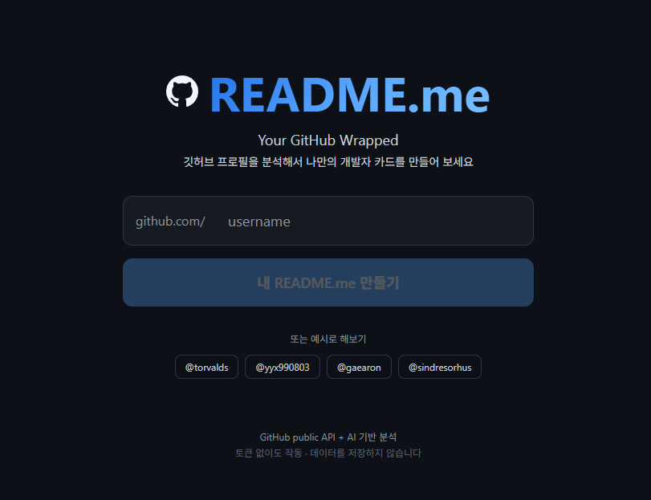

<div align="center">

<br />

# README.me
[English](README_EN.md) | **한국어**

**Spotify Wrapped, 하지만 GitHub 버전.**

GitHub 유저네임 하나면 충분합니다.<br />
AI가 당신의 코딩 성격을 분석하고, 공유할 수 있는 카드를 만들어 드립니다.

<br />


<br /><br />



<br />

</div>

## 🌐 Live Demo

GitHub 유저네임 하나로 나만의 개발자 카드를 만들어 보세요.<br />
<a href="https://readme-me-github.vercel.app/"><b>Live Demo — README.me</b></a>

<br />

## 어떤 서비스인가요?

> _"내 코딩 MBTI는 INTJ-deploy래"_

**README.me**는 GitHub 프로필을 **Spotify Wrapped** 스타일로 분석하는 웹앱입니다.

유저네임을 입력하면 AI가 당신의 레포, 언어, 활동 내역을 읽고 — **코딩 MBTI**, **프렌들리 로스트**, **공유 가능한 개발자 카드**를 만들어 줍니다. 로그인이나 토큰 없이, public 데이터만으로 작동합니다.

<br />

## 주요 기능

<table>
  <tr>
    <td width="50%">

**코딩 MBTI**<br />
<sub>AI가 만들어주는 나만의 개발자 성격 유형</sub><br />
<code>ENFP-debug</code> <code>ISTJ-refactor</code> <code>INTJ-deploy</code>

**6개 애니메이션 슬라이드**<br />
<sub>스와이프 / 탭 / 키보드 화살표로 탐색</sub>

**언어 DNA**<br />
<sub>내가 가장 많이 쓰는 언어를 시각적으로 분석</sub>

**활동 리포트**<br />
<sub>커밋, PR, 활동일수, 커밋 스타일까지</sub>

  </td>
  <td width="50%">

**프렌들리 로스트**<br />
<sub>AI가 내 GitHub 프로필을 착하게 볶아줌</sub>

**공유 카드**<br />
<sub>X (Twitter), LinkedIn 공유 + PNG 다운로드</sub>

**OG 이미지 자동 생성**<br />
<sub>SNS 공유 시 미리보기 카드 자동 생성</sub>

**로그인 불필요**<br />
<sub>토큰 없이 public 데이터만으로 작동</sub>

  </td>
  </tr>
</table>

<br />

## 슬라이드 구성

| # | 슬라이드 | 내용 |
|:---:|---|---|
| 1 | **인트로** | 아바타, 이름, 가입 기간, 레포 / 팔로워 / 스타 |
| 2 | **언어 DNA** | 상위 6개 언어 + 애니메이션 프로그레스 바 |
| 3 | **활동 리포트** | 커밋, 활동일수, PR, 포크, 커밋 스타일, 스피릿 애니멀 |
| 4 | **코딩 MBTI** | MBTI 타입, 제목, 설명, 성격 요약, 강점 |
| 5 | **로스트** | 프렌들리 로스트, 재미있는 사실들, 베스트 레포 |
| 6 | **공유** | 프리뷰 카드, SNS 공유 버튼, 카드 다운로드 |

<br />

## 작동 원리

```
GitHub 유저네임 입력
       │
       ▼
  /api/analyze (POST)
       │
       ├── GitHub REST API
       │     ├── /users/{username}           프로필
       │     ├── /users/{username}/repos     레포 (최대 200개)
       │     └── /users/{username}/events    최근 활동 (최대 100개)
       │
       ├── 데이터 가공
       │     ├── 언어 분포 (레포 크기 기반 가중치)
       │     ├── 스타 / 포크 합산
       │     ├── 활동 지표 (커밋, PR, 이슈, 활동일수)
       │     └── 상위 레포 정렬
       │
       └── OpenAI API (gpt-4o-mini)
             └── 코딩 MBTI, 로스트, 성격 분석
                 재미있는 사실, 공유용 요약 생성
       │
       ▼
  /wrapped/{username}
  6개 애니메이션 슬라이드 + 공유 카드
```

<br />

## 기술 스택

| 영역 | 기술 |
|---|---|
| **프레임워크** | Next.js 16 (App Router) + React 19 |
| **스타일링** | Tailwind CSS 4 |
| **애니메이션** | Framer Motion |
| **AI** | OpenAI API (gpt-4o-mini) |
| **데이터** | GitHub REST API |
| **OG 이미지** | @vercel/og (Edge Runtime) |
| **언어** | TypeScript |

<br />

## 프로젝트 구조

```
src/
├── app/
│   ├── api/
│   │   ├── analyze/route.ts       GitHub 수집 + AI 분석
│   │   ├── og/route.tsx           OG 이미지 생성 (Edge)
│   │   └── story/route.tsx        스토리 이미지 다운로드
│   ├── wrapped/[username]/
│   │   ├── layout.tsx             동적 OG 메타데이터
│   │   └── page.tsx               Wrapped 슬라이드 페이지
│   ├── error.tsx                  에러 페이지
│   ├── not-found.tsx              404 페이지
│   ├── globals.css                GitHub 다크 테마
│   ├── layout.tsx                 루트 레이아웃
│   └── page.tsx                   랜딩 페이지
├── components/
│   ├── Icons.tsx                  SVG 아이콘
│   ├── ShareCard.tsx              공유 슬라이드 + SNS 버튼
│   └── WrappedSlides.tsx          슬라이드 전체
└── lib/
    ├── analyze.ts                 AI 프롬프트 빌더
    └── github.ts                  GitHub API 클라이언트
```

<br />

## 시작하기

### 필수 조건

- Node.js 18+
- OpenAI API 키 — [여기서 발급](https://platform.openai.com/api-keys)

### 설치 및 실행

```bash
# 클론
git clone https://github.com/YeongJunJeong/README.me.git
cd README.me

# 의존성 설치
npm install

# 환경변수 설정
cp .env.example .env.local
```

`.env.local` 편집:

```env
OPENAI_API_KEY=sk-your-key-here

# 선택사항: GitHub API rate limit 상향 (60/hr → 5,000/hr)
GITHUB_TOKEN=ghp_your-token-here
```

```bash
# 실행
npm run dev
```

[http://localhost:3000](http://localhost:3000) 접속.

<br />

## 환경변수

| 변수 | 필수 | 설명 |
|---|:---:|---|
| `OPENAI_API_KEY` | O | OpenAI API 키 (AI 분석용) |
| `GITHUB_TOKEN` | - | GitHub 개인 액세스 토큰 (rate limit 상향) |

> 서버 측 캐싱(24시간)으로 동일 유저에 대한 반복 API 호출을 최소화합니다.

<br />

## 라이선스

[MIT](LICENSE)

---

<div align="center">

<br />

**[README.me](https://readme-me-github.vercel.app/)** — _당신의 코드가 들려주는 이야기._

<br />

</div>
